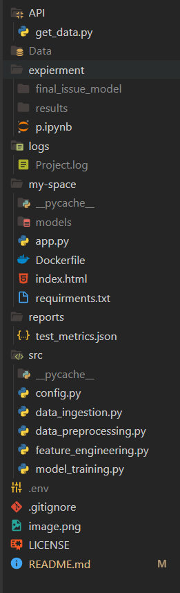
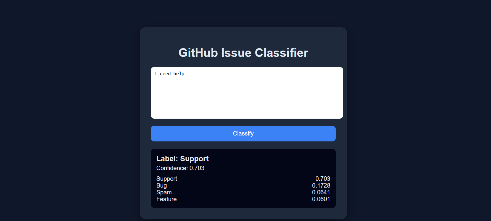

# 🚀 GitHub Issue Classifier (End-to-End MLOps Pipeline)

An automated Machine Learning pipeline designed to classify GitHub issues into four categories: **Bug, Feature, Support, or Spam**. This project covers the entire lifecycle from data scraping via GitHub API to a containerized web application using FastAPI and Docker.

---

## 📸 Project Architecture & Structure
The project is organized into a modular structure following MLOps best practices:



---

## 🖥️ Live Deployment
The application is deployed and ready for use. Users can input issue text (Title and Body) to receive real-time classification predictions, confidence scores, and raw probabilities for all classes.



---

## 🛠️ Tech Stack
*   **Language:** Python 3.10
*   **Model:** DistilBERT (Fine-tuned using HuggingFace Transformers)
*   **API Framework:** FastAPI
*   **Data Handling:** Pandas, Scikit-learn
*   **Deployment:** Docker, Uvicorn
*   **Tools:** GitHub API, Dotenv, Logging

---

## 🏗️ Pipeline Phases

### 1. Data Ingestion & Scraping
*   Automated scripts to fetch closed issues from the `microsoft/vscode` repository.
*   Handles pagination and authentication via GitHub Personal Access Tokens.

### 2. Preprocessing & Feature Engineering
*   **Data Cleaning:** Deduplication, handling missing values, and removing special characters.
*   **Label Mapping:** Consolidating raw GitHub labels into 4 distinct classes.
*   **Text Concatenation:** Merging `Title` and `Body` to provide the model with full context.
*   **Stratified Splitting:** Creating Train/Val/Test sets while maintaining class distribution.

### 3. Model Training
*   **Base Model:** `distilbert-base-uncased`.
*   **Custom Trainer:** Implemented `CustomTrainer` with **Class Weights** to handle dataset imbalance effectively.
*   **Evaluation:** Tracks Accuracy, Precision, Recall, and F1-Score using a weighted average.

### 4. API & Deployment
*   **FastAPI:** Provides a high-performance endpoint for real-time inference.
*   **Dockerized:** Fully containerized for consistent deployment across different environments.
*   **Frontend:** A clean HTML/CSS interface for users to interact with the model.

---

## 📊 Model Performance
The fine-tuned DistilBERT model achieved the following results on the test set:

| Metric | Value |
| :--- | :--- |
| **Accuracy** | 73.8% |
| **F1-Score** | 74.0% |
| **Precision** | 74.6% |

---

## 🚀 How to Run Locally

### Prerequisites
*   Docker installed **OR** Python 3.10+
*   GitHub API Key (stored in `.env`)

### Using Docker
1. Build the image:
   ```bash
   docker build -t github-classifier .
   Run the container:

Bash
docker run -p 7860:7860 github-classifier
Local Setup (Without Docker)
Install requirements:

Bash
pip install -r requirements.txt
Run the API:

Bash
uvicorn app:app --host 0.0.0.0 --port 8000
--
📝 License
Distributed under the MIT License. See LICENSE for more information.
---
Developed by Abdelwahab Amr
Feel free to reach out for collaborations or feedback!